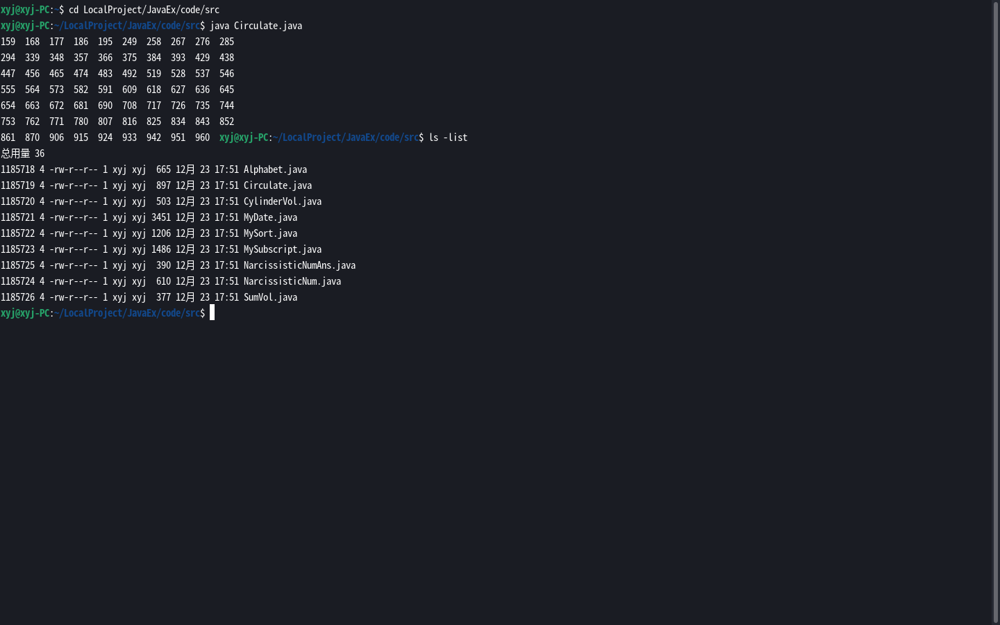

##  个人Java笔记(zh-cn)  
###  一、类（class）  
1."java 类名"命令（运行阶段），java命令后不能跟路径及.class整个文件的文件名，一定是程序里的类名。  
##### (注："java .java文件"命令为JDK13新特性，可直接编译加运行，但不生成.class文件，相当于在内存中运行生成的类)  
  
  
  
2.一个Java文件中可以包含多个类，但最多有一个公共类（除内部类外，不能包含多个公共类），公共类应与Java源文件名一致。  
  
  
  
